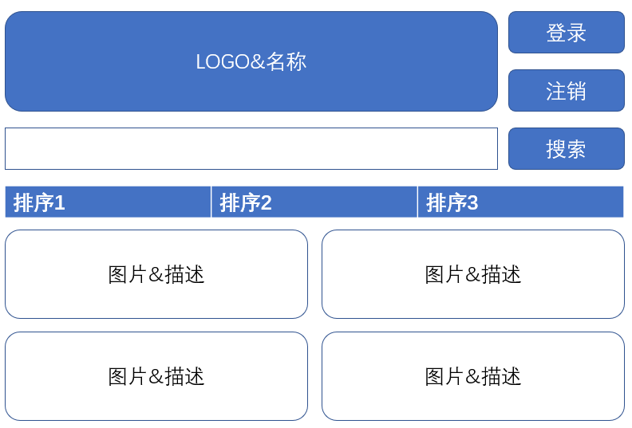
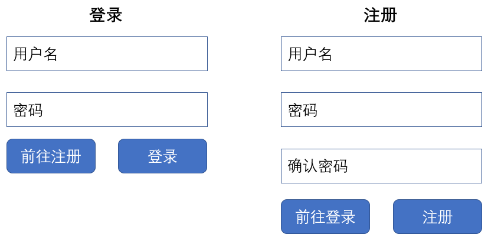
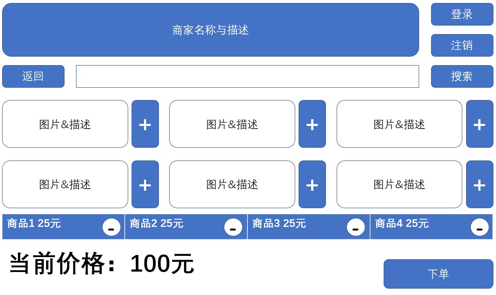

# 概要文档

## 产品简介

2014年以前，外卖作为传统餐饮行业的一条分支业务，并没有引起许多人的重视。然而近些年来，随着智能手机以及网络支付的普及，人们越来越倾向于在网络上进行购物消费，于是例如美团外卖、百度外卖、饿了吗等诸多网络外卖平台应运而生。近期受疫情影响，外卖业务也愈加火热——能够让人足不出户便可享受到美食，也越来越迎合大众的口味。因此，我们 “竹园科技有限公司” 决定制作一款完整的外卖平台系统。

作为网络外卖平台，主要功能是提供商家入驻、用户在线点餐以及餐品配送服务。要想在当前竞争如此激烈的外卖平台战场中争取到自己的一席之地，就必须在基础功能和交互中做到进一步的完善，同时通过推荐与优惠等功能提高用户粘性与吸引力，最终实现一套完整的解决方案。

目前产品名称为7Lema，取自中文名称 “吃了吗（恰了吗）” 的谐音。本产品为基于Django框架的订餐外卖系统，包含商户端、用户端与运营端，物流端待定。

## 产品实现方案

基于Python的Django框架进行WEB开发，数据库使用SQLite。产品进行模块化设计与开发，分为用户管理、界面展现、商户管理、菜品管理、订单管理、搜索处理共6个模块；数据库包含用户数据、商户数据、商品数据、订单数据以及标签数据；公司内进一步划分为功能需求与顶层设计、数据库设计、前端、后端共四部分进行协同开发，其中前后端为小组多人开发；代码托管平台使用GitHub私有仓库，并于此进行版本管理以及产品打包发布。

## 产品使用介绍

### 用户手册

- 用户主界面
  - 登录按钮
  - 注销按钮
  - 搜索框
  - 商户展示
  - 商户排序

- 登录与注册

- 详情界面
  - 商家描述
  - 商品信息查看
  - 购物车
    - 商品的添加与删除
  - 下达订单

### 商户手册

注意：商户的创建基于用户账号，每个用户账号可以绑定多个商户

- 创建商户
- 编辑商户信息
- 添加、修改以及删除商品
- 设置营业状态
- 查看与接受订单
- 设置订单状态